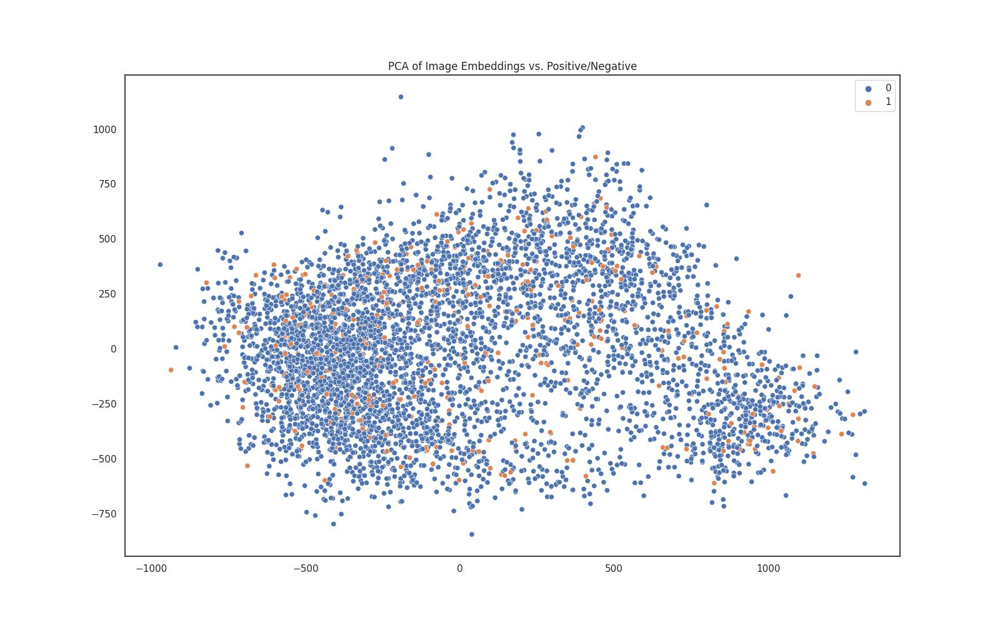
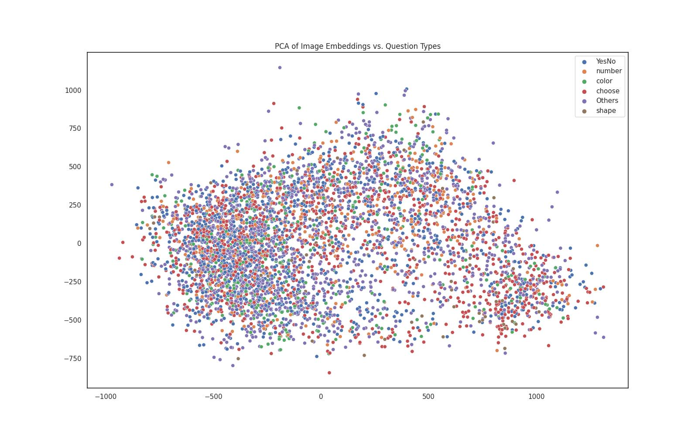
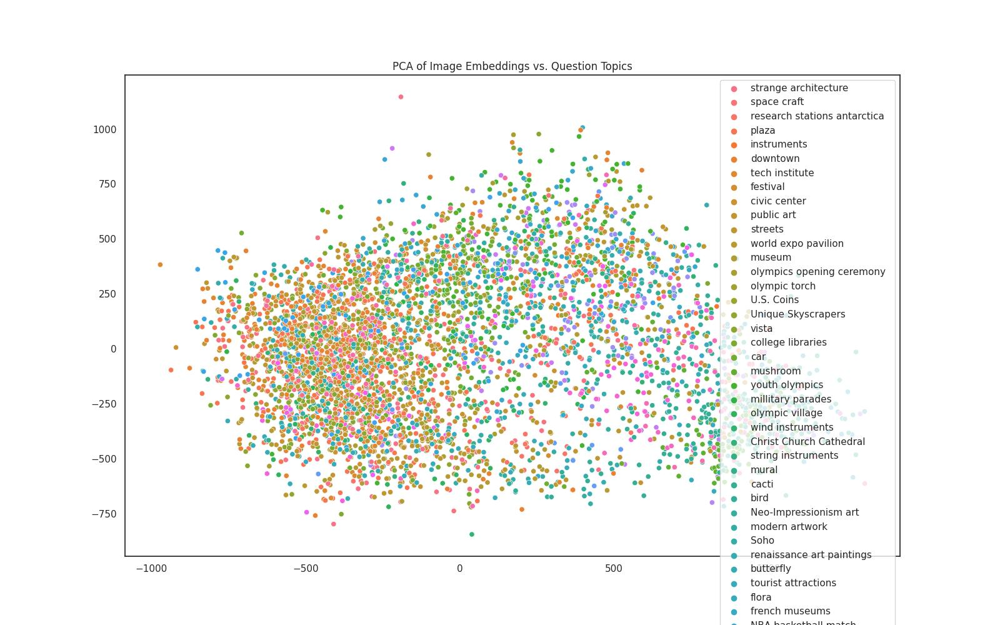
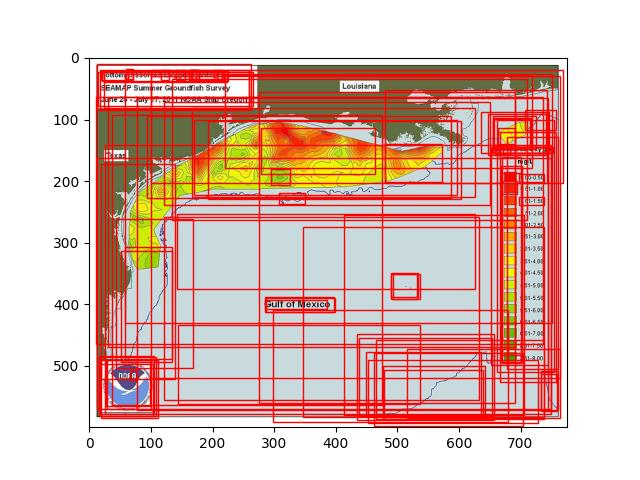
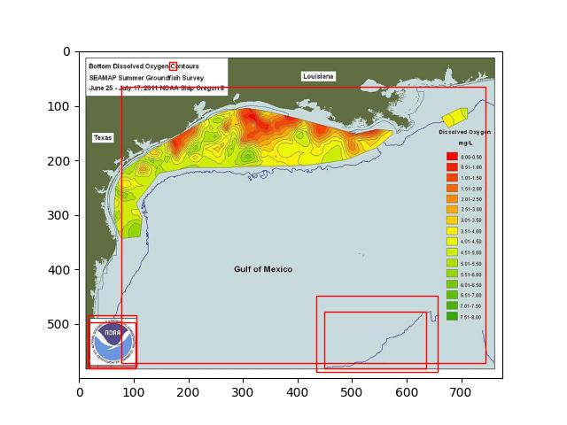

# 0. PYTHONPATH

At root of the repository:

```bash
export PYTHONPATH=$(pwd)
```

# 1. Decode Images

Run [`utils/decode_base64_images.py`](/utils/decode_base64_images.py)

# 2. Create image subset

Run [`subset_pos_neg_image_facts.py`](subset_pos_neg_image_facts.py)

This program creates [`train.tsv`](train.tsv)/[`test.tsv`](test.tsv)/[`val.tsv`](val.tsv)

# 3. Run Positive/Negative Classifier

Run [`classify_pos_neg_images.py`](classify_pos_neg_images.py)

Training batch loss


Test epoch accuracy


# 4. PCA Visualization of the RCNN Embeddings

Run [`visualize_embeddings.py`](visualize_embeddings.py)





TODO: too many topics



# 5. Visualizing RCNN Bounding Boxes and Class Labels

## Issue 1: Too many boxes without setting a min threshold of class confidence scores



## Issue 2: Overlapping bounding boxes

Bounding boxes:

```
(448.99377, 477.71466, 635.1658, 581.03076)
(435.38068, 448.46365, 656.35956, 587.0487)
(16.218733, 483.51318, 105.696884, 578.6826)
(16.918978, 497.22815, 103.425545, 581.5403)
(164.58624, 19.04927, 177.57275, 34.461514)
(77.49992, 65.20191, 744.53046, 572.20044)
```



Other images are located [here](results/rcnn_boxes)
