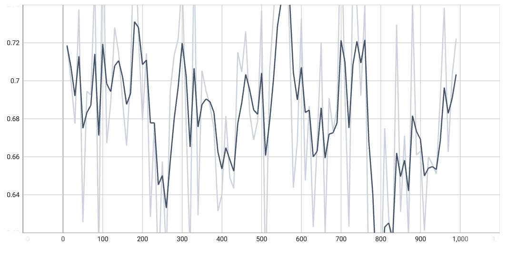

# 0. PYTHONPATH

At root of the repository:

```bash
export PYTHONPATH=$(pwd)
```

# 1. Decode Images

Run `utils/decode_base64_images.py`

# 2. Create image subset

Run `subset_pos_neg_image_facts.py`

Resulting `train.tsv` and `test.tsv`, they are already included in the repository

# 3. Run Positive/Negative Classifier

Training batch loss



Test epoch accuracy


