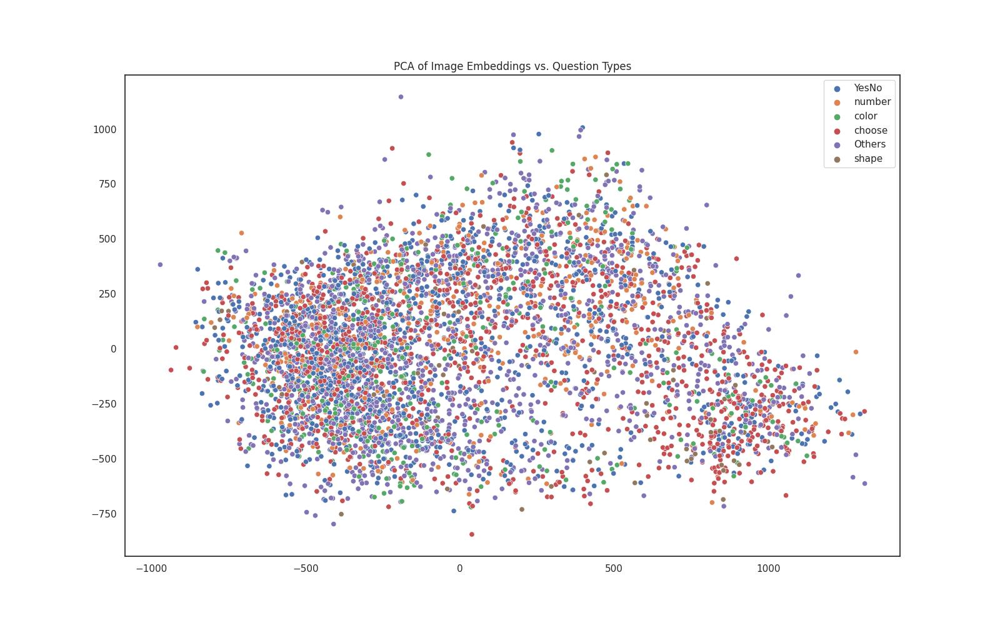
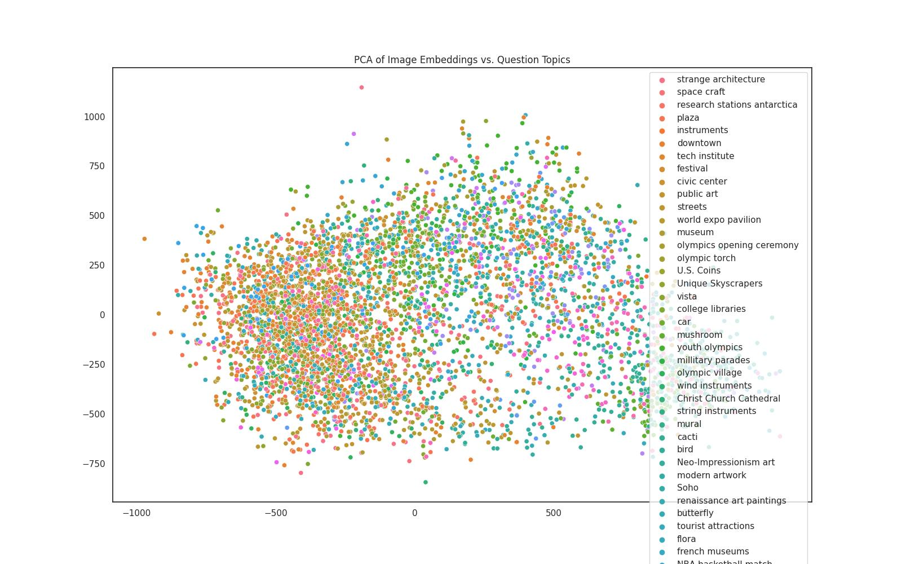

# 0. PYTHONPATH

At root of the repository:

```bash
export PYTHONPATH=$(pwd)
```

# 1. Decode Images

Run [`utils/decode_base64_images.py`](/utils/decode_base64_images.py)

# 2. Create image subset

Run [`subset_pos_neg_image_facts.py`](subset_pos_neg_image_facts.py)

This program creates [`train.tsv`](train.tsv)/[`test.tsv`](test.tsv)/[`val.tsv`](val.tsv)

# 3. Run Positive/Negative Classifier

Run [`classify_pos_neg_images.py`](classify_pos_neg_images.py)

Training batch loss


Test epoch accuracy


# 4. PCA Visualization of the RCNN Embeddings

Run [`visualize_embeddings.py`](visualize_embeddings.py)




TODO: too many topics



